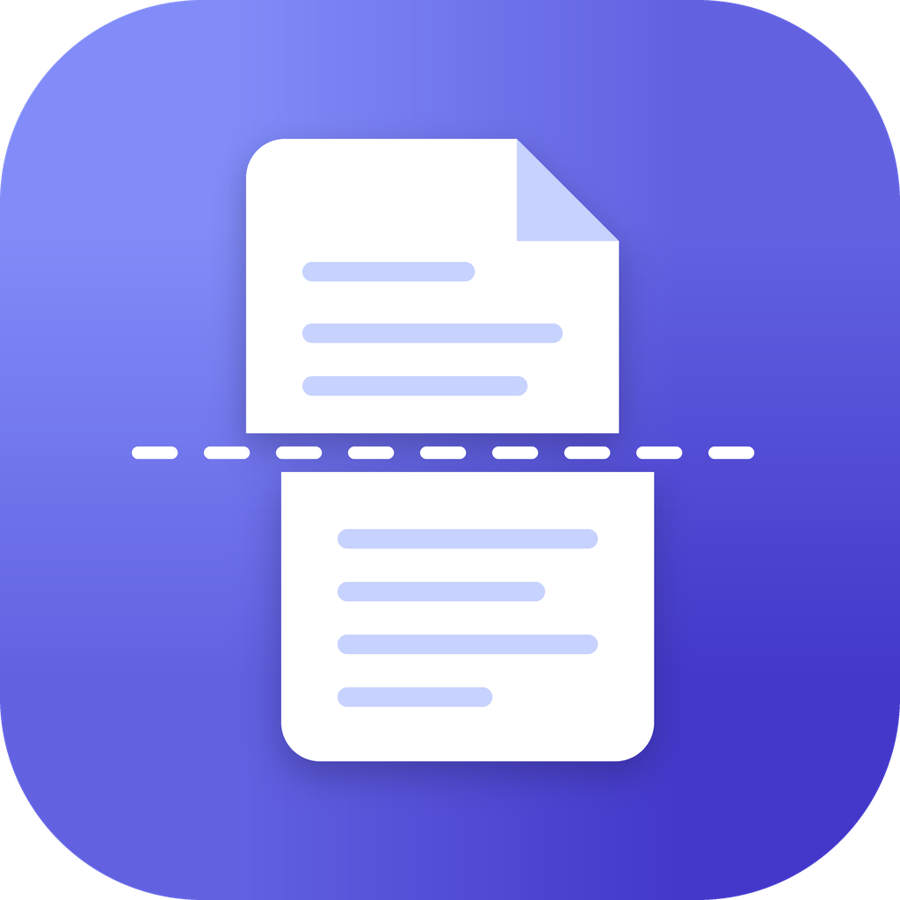
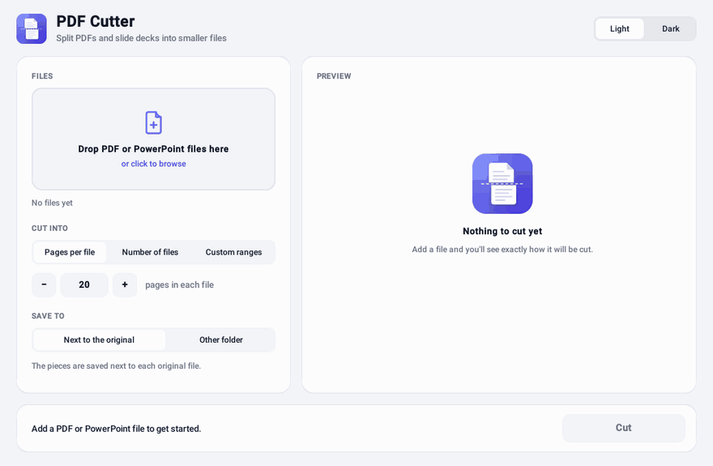
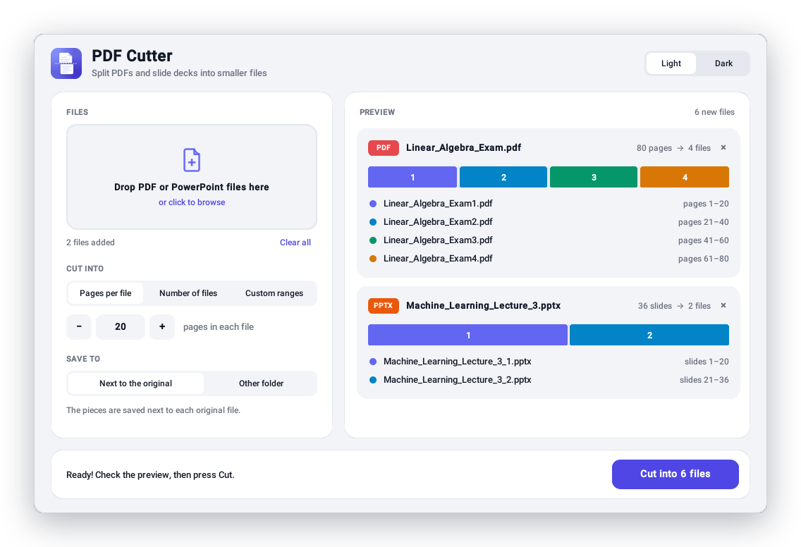
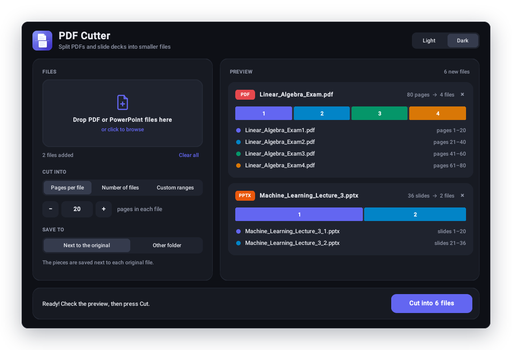
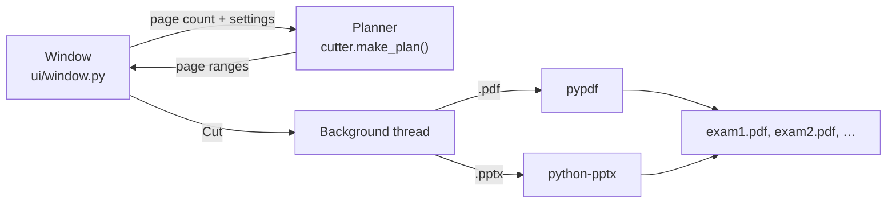

<div align="center">



# PDF Cutter

**Split big PDFs and PowerPoint decks into smaller files in a couple of clicks.**

[](https://github.com/abdulvoris2984/Pdf-cutter/actions/workflows/build.yml)
[](https://github.com/abdulvoris2984/Pdf-cutter/releases/latest)


[](LICENSE)



</div>

## Why

Lecture slides and past exam papers often arrive as one huge file. Studying them in smaller chunks is easier,
so PDF Cutter turns `exam.pdf` (80 pages) into `exam1.pdf`, `exam2.pdf`, `exam3.pdf` and `exam4.pdf`,
20 pages each.

## Features

- **Three ways to cut:** a fixed number of pages per file, a number of equal files, or custom ranges like `1-25, 26-50, 51-`.
- **PDF and PowerPoint:** `.pptx` decks are cut into smaller `.pptx` files that keep their slides, images, speaker notes and sections.
- **Visual preview:** a colored bar shows exactly where each new file starts and ends before anything is written.
- **Drag and drop**, with several files at once.
- **Light and dark mode** that follows your system.
- **Careful with your files:** originals are never touched, you're asked before anything is replaced, and copy-protected PDFs just work.
- **Works offline.** Nothing is uploaded anywhere.

<p align="center">
  
  
</p>

## Download

Get the latest version from the **[Releases page](https://github.com/abdulvoris2984/Pdf-cutter/releases/latest)**:

| Computer | File | First launch |
| --- | --- | --- |
| Windows | `PDF-Cutter-Windows.exe` | Double-click it. If you see "Windows protected your PC", click **More info → Run anyway**. |
| Mac (Apple Silicon) | `PDF-Cutter-macOS.zip` | Unzip it and move **PDF Cutter** to Applications. The first time, macOS blocks it: open **System Settings → Privacy & Security** and click **Open Anyway**. |
| Linux | `PDF-Cutter-Linux` | `chmod +x PDF-Cutter-Linux`, then run it. |

The warnings appear because the app isn't signed with a paid developer certificate.

## How to use it

1. **Add files:** drop them on the window or click the drop zone.
2. **Choose how to cut:**
   - **Pages per file:** `20` turns 80 pages into 4 files. The last file gets whatever is left over (85 pages → 20, 20, 20, 20, 5).
   - **Number of files:** `4` makes 4 files of (almost) equal size.
   - **Custom ranges:** `1-25, 26-50, 51-` makes one file per range. `51-` means "page 51 to the end".
3. **Choose where to save:** next to the original, or in another folder.
4. Check the preview and press **Cut**.

New files are named after the original: `exam.pdf` → `exam1.pdf`, `exam2.pdf`, … If the name already ends in a
number, an underscore keeps it readable: `Lecture 3.pptx` → `Lecture 3_1.pptx`.

## How it works



- **Planning is separate from the UI.** `cutter.py` turns "20 pages per file" or `"1-25, 26-50"` into a list of page
  ranges and validates them, with friendly error messages. The preview and the cutting use the same plan, so what you see is what you get.
- **PDFs** are cut with [pypdf](https://github.com/py-pdf/pypdf). Bookmarks that point into a piece are kept.
- **PowerPoint** files are harder: python-pptx has no "delete slide" function. Each piece starts from a fresh copy of the deck,
  and the unwanted slides are unlinked from `presentation.xml`, so they (and images only they used) are left out when the file is saved.
  The script also removes stale entries from PowerPoint's section list, which would otherwise make PowerPoint offer to "repair" the file.
- **Cutting runs on a background thread** so the window stays responsive. The thread reports progress through a queue that the UI polls.
- **The UI** is built with [CustomTkinter](https://github.com/TomSchimansky/CustomTkinter). Drag and drop comes from
  [tkinterdnd2](https://github.com/Eliav2/tkinterdnd2), and the preview bar is drawn on a plain Tk canvas.

### Testing and releases

- `pytest` covers the planning rules, PDF and PPTX cutting (including encrypted PDFs and PowerPoint sections), and the GUI itself:
  the tests open the real window, change settings and cut a file through it.
- On every push, [GitHub Actions](.github/workflows/build.yml) runs the tests, then builds the Windows, macOS and Linux apps with PyInstaller.
  Each packaged app runs `--self-test`, which opens its window, checks drag and drop loaded, and cuts a real file.
  Only then is a new release published.

## Project structure

```
app.py                 entry point (and the --self-test used by CI)
cutter.py              planning and cutting logic, no UI code
ui/
  window.py            the main window
  widgets.py           drop zone, preview cards, split bar, stepper
  theme.py             colors (light and dark) and fonts
assets/                app icon and UI images
scripts/
  make_icons.py        draws the icon with Pillow
  make_screenshots.py  drives the app to produce the images in docs/
tests/                 pytest tests for the logic and the GUI
pdf-cutter.spec        PyInstaller build recipe
```

## Run from source

Requires Python 3.10+ with Tkinter (included with the python.org installers).

```bash
pip install -r requirements.txt
python app.py
```

Run the tests (on Linux without a desktop, prefix with `xvfb-run -a`):

```bash
pip install pytest
pytest
```

Build the app yourself:

```bash
pip install pyinstaller
pyinstaller pdf-cutter.spec
```

## Built with

Python · CustomTkinter · tkinterdnd2 · pypdf · python-pptx · Pillow · PyInstaller · pytest · GitHub Actions

## License

[MIT](LICENSE)
